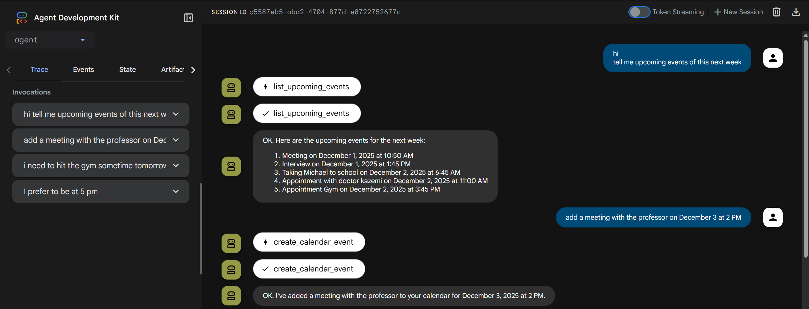
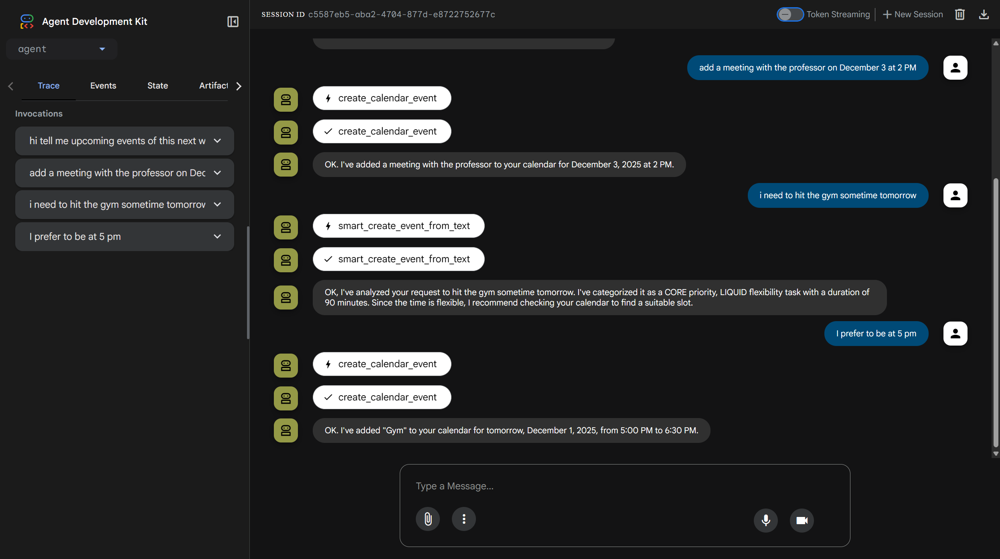
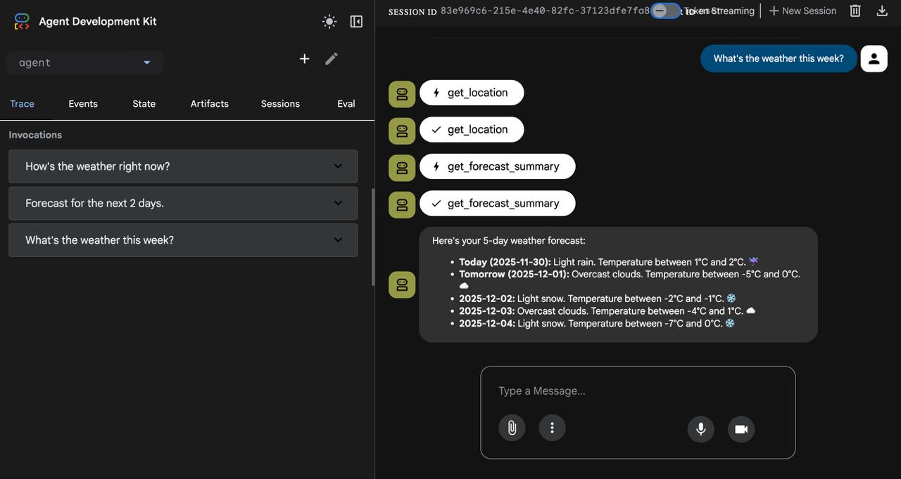
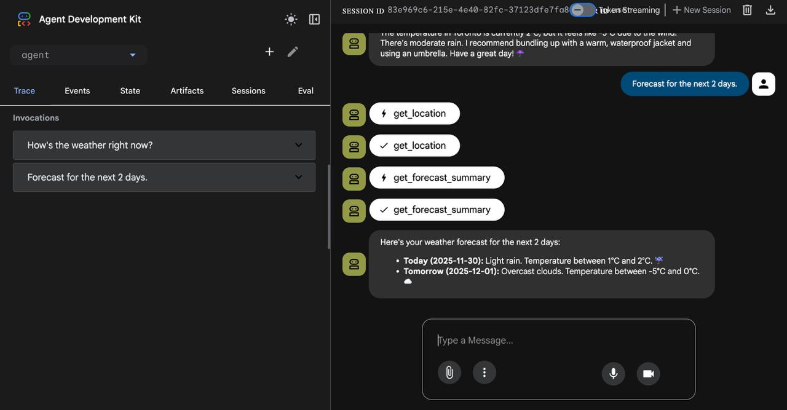

# Personal AI Assistant Agent

[](https://www.python.org/)
[](https://python-poetry.org/)
[](https://github.com/google/adk-python)


<p align="center"> A sophisticated personal assistant agent built using the Google Agent Development Kit (ADK) and Vertex AI. This agent is designed to streamline daily life management by autonomously organizing appointments, coordinating multi-attendee meetings via Google Calendar, and providing context-aware weather insights.
</p>

## 👨‍💻 Authors

- **[Sara Hashemi](https://www.linkedin.com/in/saraa-hashemii/)**
- **[Paniz Oghabi](https://www.linkedin.com/in/panizoghabi/)**
- **[Mohammad Mahdi Heydari Asl](https://www.linkedin.com/in/mohammad-mahdi-heydari-asl-bb0ba0179/)**


## 📋 Table of Contents
- [Project Overview](#-project-overview)
- [Key Features](#-key-features)
- [Architecture & Directory Structure](#-architecture--directory-structure)
- [Prerequisites](#-prerequisites)
- [Installation & Setup](#-installation--setup)
- [Configuration](#-configuration)
- [Usage](#-usage)
- [Deployment](#-deployment)

----
## 🧠 Project Overview

This project implements an intelligent agent capable of managing complex scheduling tasks and acting as a daily planner. It leverages Large Language Models (LLMs) to understand natural language requests and executes actions through specific tool integrations. The agent is designed to:
* **Optimize Scheduling:** Prioritize tasks and organize daily agendas based on urgency and user preferences.
* **Automate Coordination:** Seamlessly book events and manage invites for multiple attendees.
* **Provide Contextual Planning:** Integrate real-time weather data to inform outfit recommendations and event timing.

## ✨ Key Features

### 1. Smart Calendar Management
* **Natural Language Processing:** Create events from casual phrases like "lunch with Sarah tomorrow at noon".
* **Automated Organization:** Automatically Structures appointments and creates daily agendas automatically.
* **Priority Management:** Ranks tasks and events based on importance and deadlines.
* **Conflict Detection:** Checks for scheduling conflicts and asks for user confirmation before double-booking.
* **Flexible Event Creation:** Override conflicts when necessary with explicit user approval.

### 2. Meeting Coordination (Google Calendar Integration)
* **Event Management:** Create, edit, search, and delete calendar events directly.
* **Multi-Attendee Support:** Checks availability for multiple participants and sends invites.
* **Availability Checking:** View free/busy status to prevent scheduling conflicts.
* **Dynamic Updates:** Modify event times, add/remove guests, and update details seamlessly.

### 3. Intelligent Features
* **Smart Event Parsing:** Converts natural language into structured calendar events.
* **Calendar Analysis:** Analyzes scheduling patterns and provides optimization insights.
* **Flexibility Assessment:** Identifies movable events to help with rescheduling.
* **Task Prioritization:** Converts user input into actionable, prioritized tasks.

### 4. Weather Intelligence
* **Automatic Location Detection:** Detects user location automatically via IP geolocation.
* **Current Conditions:** Retrieves real-time weather data including temperature, conditions, and humidity.
* **Weather Forecasting:** Provides customizable forecasts for 1-5 days ahead.
* **Smart Recommendations:** Suggests appropriate clothing and outdoor activity timing based on conditions.


---
## 📂 Architecture & Directory Structure

The project follows a modular structure where the core agent logic is separated from tool definitions and deployment scripts.

        ```text
        kaggle_agent/
        ├── agent/
        │   ├── agent.py               # Core agent logic and definition
        │   ├── prompt.py              # System instructions and behavioral prompts
        │   ├── tools/                 # Integration tools
        │   │   ├── calendar_tools.py  # Google Calendar API logic
        │   │   ├── weather_tools.py   # Weather API logic
        │   │   ├── prompt_tools.py    # Utilities for dynamic prompting
        │   │   └── __init__.py
        │   └── __init__.py
        ├── deployment/                # Scripts for Vertex AI Agent Engine (e.g., deploy.py)
        ├── client_secret.json         # OAuth credentials (user-provided)
        ├── token.json                 # Auto-generated OAuth token (after first run)
        ├── run_agent.py               # Optional entry point script
        ├── pyproject.toml             # Poetry dependencies and project metadata
        ├── poetry.lock                # Locked dependency versions
        ├── .env                       # Environment variables
        └── README.md                  # Project documentation
        ```

## 🛠 Prerequisites
Before running the agent, ensure you have the following installed and configured:

* Python 3.9+

* [Poetry](https://python-poetry.org/) for dependency management

* Google Cloud Platform Project:

    * Access to Vertex AI (for Gemini models)
    * Google Calendar API enabled

* API Keys:
    * A Gemini API Key (or Vertex AI credentials)
    * OpenWeather API Key (free tier available at [openweathermap.org](https://openweathermap.org/api))

* Python Agent Development Kit (ADK):
  * Installation: [adk-python on GitHub](https://github.com/google/adk-python)
  * Documentation: [ADK Quickstart Guide](https://google.github.io/adk-docs/get-started/quickstart/)

## 🚀 Installation & Setup
#### 1. Clone the repository and navigate to the agent's directory:
```sh
git clone https://github.com/....
cd kaggle_agent
```
#### 2. Install Dependencies
Install the required Python packages using Poetry
```sh
# Install the required Python packages using Poetry
poetry install
```
#### 3. Activate the virtual environment
```sh
source .venv/bin/activate
```

#### 4. Google Calendar Authentication
To enable calendar scheduling, you must authenticate via OAuth 2.0:

1. **Enable Google Calendar API:**
   * Go to [Google Cloud Console](https://console.cloud.google.com/)
   * Navigate to **APIs & Services > Library**
   * Search for "Google Calendar API" and enable it

2. **Create OAuth 2.0 Credentials:**
   * Go to **APIs & Services > Credentials**
   * Click **+ CREATE CREDENTIALS** > **OAuth 2.0 Client ID**
   * Application type: **Desktop app**
   * Download the JSON file

3. **Configure Credentials:**
   * Rename the downloaded file to `client_secret.json`
   * Place it in the root directory (`kaggle_agent/`)

4. **First-Time Authentication:**
   * Upon the first execution, a browser window will open prompting you to log in
   * Grant the necessary Calendar permissions
   * A `token.json` file will be generated automatically for future sessions


## ⚙️ Configuration

To run the agent, you must set up the necessary environment variables.

1.  Create a `.env` file in the root directory of the project (`kaggle_agent/`).
```sh
touch .env
```
2.  Copy the settings below and fill in your specific Google Cloud details:

```ini
# .env Configuration
GOOGLE_GENAI_USE_VERTEXAI=1
GOOGLE_CLOUD_PROJECT="your-google-cloud-project-id"
GOOGLE_CLOUD_LOCATION="europe-west1"
GOOGLE_CLOUD_STORAGE_BUCKET="your-storage-bucket-name"
ROOT_AGENT_MODEL="gemini-2.0-flash-001"
WEATHER_API_KEY="your_weather_provider_key"
 
```

🔑 **Authentication Note:** This agent integrates with external services like Google Calendar. Upon the first run, you will be prompted to authenticate via a browser window. A token.json file will be automatically created to store your credentials for future sessions.

## 💻 Usage
You can run the agent using the command line or the recommended Visual Developer UI.

### Option A: ADK Developer UI (Recommended)
This provides a web interface to interact with the agent visually:

```sh 
adk web 
```

After running the command, open the local URL provided in the terminal to chat with the agent.

### Option B: CLI Interaction
Run the agent directly in your terminal:
```sh
adk run
```


### 🗣️ Example Interaction

Once the agent is running, you can interact with it using natural language. Here are specific examples of what you can ask:

#### 📅 Scheduling & Planning
> "What's on my calendar today?"

> "I have a dentist appointment at 4pm tomorrow."

> "I have these tasks — help me prioritize them."

> "Find a time to study for 2 hours today."

#### 👥 Meeting Management
> "Schedule a meeting with alice@gmail.com and mark@gmail.com."

> "Add another guest to my meeting at 3 PM."

> "Am I free tomorrow at 4 PM?"

> "Add lisa@company.com to my 3 PM meeting."

#### 🧠 Smart Planning

> "I need to finish a report, go to the gym, and meet with my team. Help me organize this."

> "Find a 2-hour block for focused work today."

> "What events can I reschedule if needed?"

> "Analyze my calendar and suggest improvements."

#### 📝 Daily Life
> "What’s my schedule for today?"

> "Help me organize my week."

### 🔍 Search & Analysis

> "Find all my meetings with John last month."

> "Search for events with the word 'budget' in the title."

> "Show me all events at the downtown office."

> "What's my schedule looking like next week?"

#### ⛅ Weather Intelligence

> "What’s the weather today?"

>"What's the weather this week?

> "What should I wear today?"

> "Forecast for the next 2 days."


## ☁️ Deployment
This agent is architected for deployment to the **Vertex AI Agent Engine**.

### Deployment Requirements
Before deploying, ensure you have:

- ✅ **Google Cloud Project** with Vertex AI APIs enabled
- ✅ **IAM Roles:**
  - Vertex AI User
  - Storage Admin
  - Service Account User
- ✅ **Staging GCS Bucket** for artifact storage
- Deployment scripts and specific instructions regarding the deployment/ directory will be added in future updates.

## 📚 Additional Resources

- [Google Calendar API Documentation](https://developers.google.com/calendar/api)
- [OpenWeather API Documentation](https://openweathermap.org/api)
- [Python Agent Development Kit (ADK)](https://github.com/google/adk-python)
- [ADK Quickstart Guide](https://google.github.io/adk-docs/get-started/quickstart/)
- [Vertex AI Agent Development Kit](https://github.com/google/agent-development-kit)
- [Poetry Documentation](https://python-poetry.org/docs/)


## 📚 some screenshots

See the Personal AI Agent in action via the ADK Developer UI.
### 1. Seamless Calendar Management
The agent acts as a direct interface to Google Calendar. It can retrieve your schedule to answer questions about availability and instantly book new specific appointments.


*In this example, the user asks for upcoming events. The agent triggers the `list_upcoming_events` tool to retrieve the data, then immediately processes a follow-up request to book a meeting using `Calendar`.*

### 2. Intelligent "Vague" Scheduling
Unlike standard tools, this agent understands intent. If you have a vague task (e.g., "hit the gym"), the agent analyzes the request, assigns it a priority and duration, and negotiates the best time slot with you.


*Here, the agent uses the `smart_create_event_from_text` tool. It recognizes the task's duration (90 mins) and flexibility ("Liquid"). It asks for a preferred time ("5 pm") before finalizing the booking.*

### 3. Context-Aware Weather Insights
The agent intelligently chains tools to answer questions. It identifies the user's location first, then queries the weather service to provide accurate multi-day forecasts.


*The agent executes a chain of thought: first running `get_location` to ensure context, followed by `get_forecast_summary` to present a structured, easy-to-read 5-day forecast.*


